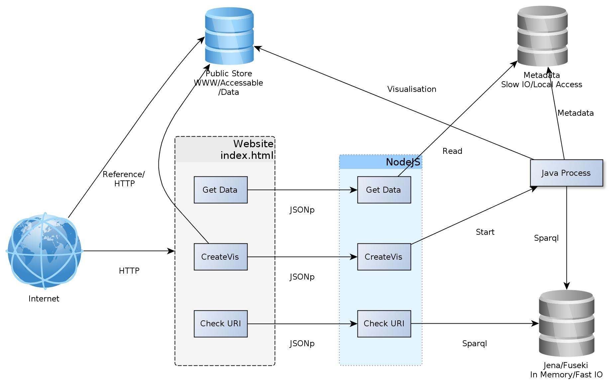

# cvServer
## Context Visualisation Server

Server side setup of the LWMap Server like it was used on [http://lwmap.uni-koeln.de/](http://lwmap.uni-koeln.de/)

Its was created as Part of my dissertation: http://kups.ub.uni-koeln.de/id/eprint/7533

Create your own Wikipedia Map:
 
**choose** starting-articles and link-language, **browse** the visualization, **filter** the interesting Nodes, **download and share** your visualization.

## About

The context visualisations server was created as part of my [dissertation](http://kups.ub.uni-koeln.de/id/eprint/7533). 

It originally and hopefully still runs on [http://lwmap.uni-koeln.de/](http://lwmap.uni-koeln.de/) with data form DBpedia 3.9.

The following installation description describes how to setup and Install the system on a Linux (Ubuntu 16.04 LTS should work).

## Overview

## Folders

[./createData](./createData) Contains the create Data script, which Build up the base Data for the Application.

[./doc](doc) contains Documentation

[./Java_exec](Java_exec) contains the java Routines used to create the nets. 

[./run](run) contains Nodejs Server scripts

[./Settings](Settings) contains Setting files and Example for Settings see Readme File

[./www_content](www_content) contains the Data For the Web-server

[./fuseki](fuseki) Install Fuseki here (install.sh)

[./cvManagement](cvManagement) Holds Start/restart/Checklog scripts see readme for Configuration

[./UserTracking](UserTracking) contains a description of the user tracking system an the prototype Database

## Dependencies

Java 7, openJDK to Execute Fuseki and the Core Executeable.

[nodejs, v0.10](https://nodejs.org/dist/v0.10.36/node-v0.10.36-linux-x64.tar.gz) for the Server Programm and the user Tracking 

A Webserver(apache, nginx) for the static Data.

## Docker

The There is a Docker Testbed including all dependencies.

### Execute Image
sudo docker build . -t my:cvServer

sudo docker run --name cvServer -v _TriplesInTDB_:/srv/cvserver_data/triples/ -p 8090:8090 -p 3030:3030 -p 8080:80 my:cvServer

Replace the _TriplesInTDB_ with the Folder where you executed [createData script](./createData/createData.sh)

### Used Ports
There are Three Ports Used: 

* _8080_ for the Webfrontend this you can call with your browser
* _8090_ This is the port of the Internal nodeJS Server
* _3030_ Fuseki (RDF Triplestore)

Make shure these ports are unused when starting the Container! For Changes [Setting/dockerSettings/local.json](Setting/dockerSettings/local.json) must be altered!!

### Futher Access

#### User Tracking 

The User Tracking Database can be Access by Opening the MySQl/MariaDB port (usually 3306).

Add: -p<Localport>:3306

Then you can access the Database with the Database Management tool of you choice.

#### Extra Mountpoints

There are Folder containing the Data which maybe should not stay only inside the container. you can mount some Folders to make the Data Permanent:

/usr/local/apache2/htdocs/pubfiles

## Prepare data

In folder [createData](./createData) is a script that will prepare all the Data form the DBpedia dump 2016. 

_WARNING_ Executing the Script will take a lot of diskspace, the Process will consume a lot of RAM (6GB preset) and it will take a lot of time(more than 4 Hours depending on your system).

Download dbpedia Page Links, classes and redirects (for lookups) form dbpedia. 

In the project the Internationalized links and the classes Files where Taken from DBpedia.

http://wiki.dbpedia.org/Downloads

Afterwards compress them into TDB-Databases. 

http://jena.apache.org/

These files must be linked in the [setting/local.ttl](Settings/local.ttl)

 attribute:  tdb:location.

The location.ttl can be modified from the example file Settings/fuseki-test.ttl

In the example the TDB stores are in _/var/opt/cvserver_data/_ , replace it with the Folders of the created TDB stores.

The Triple-store can be on another server (Load balancing).

## Manual Installation

configure [setting/local.json](setting/local.json) see [setting/readme.txt](Settings/readme.txt) for instructions.

execute [install.sh](install.sh)  This will download and unpack [Apache fuseki](http://jena.apache.org/) to [./fuseki](fuseki) and [SigmaJS](http://sigmajs.org/), [Bootstrap](http://getbootstrap.com/)  in the [www_content](www_content) Folder, it will also change settings in the settings of www_content so run before moving the www_content.

If you can Proceed take a look at the content of the Scripts and the [Dockerfile](Dockerfile) to get a deeper insight into what happens at installation time!

#### Nodejs packages

Install npm Packages:

[sparql](git://github.com/thomasfr/node-sparql-client.git), [mysql](https://github.com/felixge/node-mysql)

### Configure Web-Server

Copy the Web-Frontend

example:

 cp -r /opt/CVServer/www_content/ /var/www/ContextVis/

The project needs a subfolder _*pubfiles*_ in the Web Documents where the created _gexf_ files are stored [setting/local.json](setting/local.json) (see [setting/readme.txt](Settings/readme.txt) for instructions)

### User tracking:

* Get an Mysql/MariaDB Database (install it on the machine for example) 
* create Database
* read Database structure from UserTracking/UserTracking.sql into Database
* Add Database configuraion to [setting/local.json](setting/local.json) see [setting/readme.txt](Settings/readme.txt) for instructions

## Starting The Server 

Run with CV Management:

Configure the CV-management see [cvManagement/Readme.txt](cvManagement/Readme.txt)

[cvManagement/node_start.sh](cvManagement/node_start.sh)  Start the Node JS Server

[cvManagement/node_restart.sh](cvManagement/node_restart.sh) Restarts The nodejs Server if its allready Running

[cvManagement/node_checklog.sh](cvManagement/node_checklog.sh) tails the log of the Nodejs Server

[cvManagement/fuseki_start.sh](cvManagement/fuseki_start.sh) Start fuseki

[cvManagement/fuseki_restart.sh](cvManagement/fuseki_restart.sh) Restarts fukseki

[cvManagement/fuseki_checklog.sh](cvManagement/fuseki_checklog.sh) tails the log of fuseki